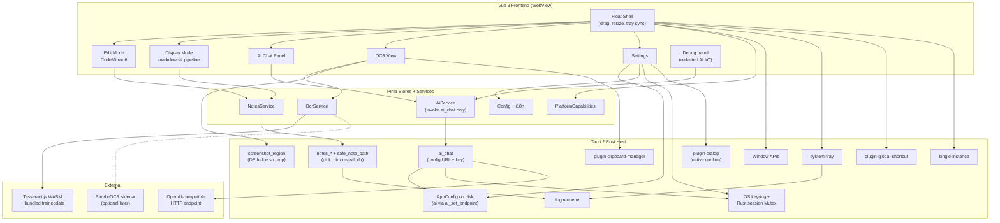
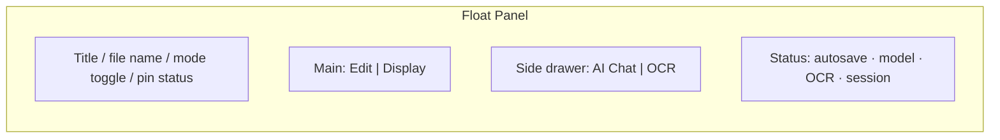
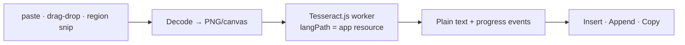

# FloatMD — Floating Desktop Notes, OCR & AI Assistant

| Field | Value |
|-------|-------|
| **Document** | Design Specification |
| **Author** | TBD |
| **Date** | 2026-08-28 |
| **Status** | Draft |
| **Version** | 0.5 |
| **Target platforms** | Linux (primary: X11 / XWayland full float; Wayland best-effort), Windows / macOS (stretch) |

---

## Overview

FloatMD is a lightweight floating desktop utility for capturing notes as Markdown (`.md`), rendering them as a beautified preview, extracting text from images via OCR, and invoking short-context AI assistance through any OpenAI-compatible API. It targets users who keep a scratchpad beside their work — not a full IDE or knowledge base.

The application is built with **Tauri 2 + Vue 3 + TypeScript + Vite**, using **CodeMirror 6** for source editing (line numbers, multi-line selection for AI context) and a **markdown-it** pipeline for sanitized, syntax-highlighted preview. Notes live as plain files under a Rust-managed `notesDir` (default: app-data subdirectory created on first launch; optional change only via a **Rust-owned folder dialog**). All note I/O goes through **custom Rust commands** using `safe_note_path` (no broad WebView fs scope). AI traffic goes through a **Rust-side HTTP proxy** that reads `baseURL`/`model` from Rust-managed `AppConfig` (endpoint changes require a **native confirmation dialog** via dedicated `ai_set_endpoint` — stripped from generic `config_set`) and the API key from the OS keyring or a Rust process-memory session slot. Responses use a strict JSON schema (`reply` vs `replace`). OCR targets **Chinese-first quality**: **PaddleOCR sidecar** is in scope **before public beta** (PP-OCRv5/v6 or ONNX equivalent). **Tesseract.js** (`eng` + `chi_sim` bundled) remains the **dev/fallback** backend behind the same `OcrService` interface so the UI can ship before the sidecar is ready.

Always-on-top and global hotkeys are **best-effort on Wayland** (tao/Tauri limitations); X11/XWayland is the primary path for full float semantics, with tray + in-app toggle as graceful degradation.

---

## Background & Motivation

### Current state / pain points

Desktop note and Markdown tools fall into three imperfect buckets for the “floating scratchpad + AI + OCR” use case:

1. **Heavy Electron MD editors** (150–300 MB) — overkill for a float panel; slow cold start; poor “widget” feel.
2. **WYSIWYG / block editors** (Milkdown, TipTap) — lose raw line fidelity needed for “multi-select lines → send to AI as context.”
3. **Screenshot / OCR utilities** — often one-shot clipboard tools with no persistent note surface or AI edit loop.

Chinese-language users additionally need reliable CJK OCR and UI, which pure Tesseract setups often under-serve without a hybrid path.

### Why now

- **Tauri 2** is mature enough for frameless windows, system tray, and (where the compositor allows) always-on-top / global shortcuts. Simple Tauri float shells in prior art are often cited around **~5–15 MB**; FloatMD will be **larger** once CodeMirror, preview assets, Tesseract WASM, and bundled `chi_sim`/`eng` traineddata are included (see size targets below).
- OpenAI-compatible endpoints (DeepSeek, Ollama, local gateways) make a thin, configurable AI client sufficient — no vendor lock-in, no tool-calling complexity.
- Files-first Markdown remains the most portable, git-friendly note format.

---

## Goals & Non-Goals

### Goals

| ID | Goal |
|----|------|
| G1 | Frameless, resizable, draggable floating panel with system tray; **best-effort** always-on-top and position memory where the compositor supports them (full on X11/XWayland; degraded on Wayland — see Platform degradation); toggle via tray and hotkey/in-app shortcut |
| G2 | Dual-mode note surface: **Edit** (CodeMirror 6, line numbers, multi-select) and **Display** (beautified Markdown preview) |
| G3 | Persist notes as `.md` files under a configurable directory with crash-safe autosave |
| G4 | Short-context AI chat via OpenAI-compatible API (Rust proxy); JSON actions `reply` / `replace`; no tool calls |
| G5 | OCR from paste, drag-drop, and **best-effort in-app region screenshot** (DE helpers → fullscreen+crop → paste fallback) → insert into note or copy; **PaddleOCR sidecar before beta**, Tesseract.js as fallback |
| G6 | Secure storage of API keys in the **OS keyring** (or Rust process-memory session slot); key **never** returned to or retained in the WebView |
| G7 | Chinese + English UI (i18n) |
| G8 | Linux-first packaging; Windows/macOS as stretch goals |

### Non-Goals (v1)

| ID | Non-Goal |
|----|----------|
| NG1 | Long-context RAG, embeddings, or vector search over the notes corpus |
| NG2 | OpenAI function calling / tools / MCP agent loops |
| NG3 | Collaborative editing, sync, or cloud accounts |
| NG4 | Full WYSIWYG Markdown editing |
| NG5 | Plugin marketplace or extension host |
| NG6 | Streaming AI responses (optional later; v1 is request/response) |
| NG7 | Mobile or web-hosted versions |
| NG8 | Guaranteed always-on-top or global hotkeys on every Wayland compositor |

---

## Proposed Design

### High-level architecture



### Process model

- **Single main window** (not a separate float child): frameless panel (`decorations: false`, `skip_taskbar: true` where supported). `always_on_top` requested only when `PlatformCapabilities.alwaysOnTop === true`.
- **Single-instance**: second launch focuses/shows the existing window (Tauri single-instance plugin).
- **System tray**: show/hide, quit, **open notes folder** (`notes_reveal_dir` via opener on configured `notesDir` only), open settings. Primary recovery path when always-on-top/hotkey are unavailable.
- **Toggle input** (in priority order): global hotkey (if registered) → tray → in-app shortcut (e.g. when focused).
- Frontend talks to host via Tauri `invoke` / events; **no Node.js**; **no direct `fetch` to AI endpoints** from the WebView in v1.

### Platform degradation (X11 vs Wayland)

Upstream **tao** documents `always_on_top` / `always_on_bottom` and outer position APIs as **Unsupported on Linux (Wayland)**; Tauri callers often see silent no-ops. FloatMD therefore treats G1 float semantics as:

| Capability | X11 / XWayland | Wayland (native) |
|------------|----------------|------------------|
| Frameless, resize, drag | Yes | Yes |
| `always_on_top` | Yes — enable and show “Pinned” affordance | **No** — do not show a false “Pinned” toggle as effective; status bar: “Pin unavailable on Wayland” |
| Remember outer position / multi-monitor | Yes — persist `window.bounds` | **Best-effort / often no-op** — persist size; on restore, rely on compositor placement; log detection |
| Global hotkey | `tauri-plugin-global-shortcut` (`XGrabKey`-class) | Portal / compositor-dependent; if registration fails → **tray + in-app toggle only** with first-run copy |
| Screenshot (region) | Ordered DE helpers → fullscreen+crop (see OCR / `screenshot_region`) | Same; `grim`+`slurp` preferred when Wayland tools present |

**Detection**: at startup, Rust probes session type (`XDG_SESSION_TYPE`, Wayland display env) and whether `set_always_on_top(true)` appears to stick (read-back if available). Probe which screenshot helpers exist on `PATH`. Expose:

```typescript
interface PlatformCapabilities {
  session: "x11" | "wayland" | "unknown";
  desktop?: string; // XDG_CURRENT_DESKTOP
  alwaysOnTop: boolean;
  positionRestore: boolean;
  globalShortcut: boolean; // false if registration failed
  globalShortcutError?: string;
  /** Best available snip path; paste/drag-drop always remain available */
  regionScreenshot: "interactive-helper" | "fullscreen-crop" | "unavailable";
}
```

UI must never claim “always on top” when `alwaysOnTop === false`. Offer an optional reminder toast: “Use tray icon to show FloatMD” on Wayland first run.

### Window & shell behavior

Inspired by floating Tauri + Vue patterns (e.g. adoin/tauri-todos: alwaysOnTop, transparent, decorations:false, skipTaskbar):

| Behavior | Spec |
|----------|------|
| Drag | Custom title-bar / drag region (`data-tauri-drag-region`) |
| Resize | Native resize edges; min size ~320×240; default ~480×640 |
| Opacity | Optional user opacity slider (stretch); default opaque frameless |
| Focus | Hotkey/tray brings to front; Escape hides to tray (configurable) |
| Multi-monitor | Persist bounds when `positionRestore`; else size only |
| Chrome | Opaque frameless v1; transparent/acrylic is feature-flagged stretch |

**Default hotkey (MVP)**: `Ctrl+Alt+Space` — avoids common GNOME/KDE `Ctrl+Alt+T/←/→` and `Super`-based binds. User-rebindable in Settings. If registration fails, Settings shows “Global hotkey unavailable; use tray or in-app Ctrl+Shift+M”.

### Application layout



- **Mode toggle**: Edit ↔ Display (mutually exclusive for the main pane).
- **Side panels**: AI and OCR as tabs in a collapsible drawer.
- **File switcher**: simple list + “New note” / rename / delete (v1: single active note, no multi-tab).

### Edit mode (CodeMirror 6)

**Why CodeMirror 6**: line numbers, gutters, multi-line selection, VS Code–like feel without Monaco’s weight. WYSIWYG (Milkdown/TipTap) rejected for line-accurate AI context.

Responsibilities:

- Markdown syntax highlighting.
- Line numbers, monospace font, soft wrap toggle.
- Selection → `EditorSelectionContext` for AI.
- Shortcuts: flush save, toggle Display, open AI with selection.

```typescript
interface EditorSelectionContext {
  filePath: string;
  /** Inclusive 1-based line range of the apply target */
  startLine: number;
  endLine: number;
  /** Exact text of that line range at snapshot time (includes newlines as in CM doc) */
  text: string;
  /** SHA-256 hex digest of UTF-8 bytes of `text` (normative; used in PR 7 fixtures) */
  textHash: string;
  /** Cursor anchor (doc offset) used when selection is empty */
  cursorOffset: number;
  /** True if CM had multiple ranges; v1 uses primary range only */
  multiRangeWarning: boolean;
}
```

**Multi-range policy (v1)**: if CodeMirror has multiple selections, use the **primary** range only and show a one-line warning in the AI panel (“Using primary selection only”). Union-of-ranges is stretch.

### Display mode (beautified Markdown)

```
.md source
  → markdown-it (GFM-ish: tables, strikethrough, task lists, anchors; html: false)
  → highlight.js (v1 — smaller than full Shiki; common languages only)
  → KaTeX for math (lazy)
  → Mermaid for diagrams (lazy, sandboxed — see Security)
  → DOMPurify.sanitize(html, DOMPURIFY_CONFIG)
  → inject into preview root (no v-html of unsanitized strings)
```

**highlight.js for v1** (size); Shiki optional later behind lazy language loading.

Display mode is **read-only**. Toggle restores `scrollTop` + selection when possible.

### Notes persistence (files-first)

| Concern | Design |
|---------|--------|
| Storage | Plain `.md` files in configurable `notesDir` |
| Default path (MVP) | Rust creates `{app_data_dir}/notes` on first launch (Linux: typically `~/.local/share/floatmd/notes`). **No user path required for MVP.** Product may still prefer Documents — see Open Questions |
| Naming | `YYYY-MM-DD-HHmmss.md` for new notes; rename via UI (filename allowlist) |
| Autosave | Debounce **600 ms**; **flush** on blur, tray hide, `CloseRequested`, and before AI `replace` apply |
| Atomic write | Write `{name}.md.tmp` → `fsync` → rename over target; on crash, ignore orphan `.tmp` |
| Quit with pending debounce | Cancel timer and **synchronous flush** in hide/quit handlers |
| Conflict | On focus, compare mtime + size; if external change and dirty → prompt Keep / Reload; if not dirty → auto-reload |
| Delete | `notes_delete` moves to `{notesDir}/.trash/` (same volume rename); empty trash not in v1 UI (manual) |
| Rename collision | If target exists → error `NoteExists`; no overwrite |
| Encoding | UTF-8 |

```typescript
interface NoteMeta {
  path: string;
  name: string;       // filename
  title: string;      // first ATX heading or stem without extension
  mtimeMs: number;
  sizeBytes: number;
}

interface NotesService {
  listNotes(): Promise<NoteMeta[]>;
  /** `name` is a single filename segment, not an absolute path */
  readNote(name: string): Promise<string>;
  writeNote(name: string, content: string): Promise<void>;
  createNote(title?: string): Promise<NoteMeta>;
  renameNote(name: string, newName: string): Promise<NoteMeta>;
  deleteNote(name: string): Promise<void>;
  getNotesDir(): Promise<string>;
  /** Opens native folder dialog in Rust; no path argument from WebView */
  pickNotesDir(): Promise<string | null>;
  /** Opens configured notesDir in the system file manager (opener) */
  revealNotesDir(): Promise<void>;
}
```

#### Notes path enforcement (no broad WebView fs scope)

**v1 model**: the WebView does **not** use `@tauri-apps/plugin-fs` for notes. Frontend passes **filenames only** (or omit path and let Rust allocate names for create). All note I/O goes through custom Rust `notes_*` commands.

##### `safe_note_path(notesDir, relativeName)` (normative)

```text
1. Require notesDir exists (create default on first launch); let root = canonicalize(notesDir).
2. Reject relativeName if it is absolute, contains `\0`, contains `/` or `\`, is `.` or `..`,
   or fails allowlist ^[A-Za-z0-9._-]+$ (optionally require .md suffix for note files).
3. let candidate = root.join(relativeName)  // single segment only in v1
4. let parent = canonicalize(candidate.parent())  // parent must exist (= root or root/.trash)
5. Reject unless parent == root OR parent == canonicalize(root.join(".trash"))
6. For **existing** files: optionally canonicalize(candidate) and re-check prefix under root
7. For **new** files: do NOT canonicalize(candidate) (it does not exist yet); use candidate
   after steps 1–5; create via write to candidate or candidate + ".tmp" then rename
```

Same pattern for rename targets (validate `newName` as a single allowlisted segment) and trash moves (`safe_note_path` under `.trash/` after ensuring `.trash` exists under `root`).

##### Changing `notesDir` — Rust-owned dialog only

There is **no** WebView-trusted `notes_set_dir({ path })`.

**`notes_pick_dir`** (takes **no path argument**):

1. Rust opens native folder dialog (`tauri-plugin-dialog` / rfd) **inside the command**.
2. If user cancels → return `null`; config unchanged.
3. Canonicalize selected path; reject if not a directory.
4. Persist as `notesDir` in `config.json` (atomic write); update in-memory guard.
5. Return the new path string for UI display only.
6. Reload note list; if current file is outside the new dir → clear editor / prompt copy into new dir.

**Rejected**: any invoke that supplies an absolute path string to set `notesDir` without a Rust-owned dialog. XSS cannot retarget the notes tree to `~/.ssh` via a bare path argument.

**Default**: on first launch, Rust creates `{app_data_dir}/notes` (+ `.trash/`) and sets `notesDir` there — MVP needs no picker.

**Tests (PR 3 / PR 9)**: `notes_set_dir` / path-bearing set must not exist or must fail; invoke with a forged path string must not change `notesDir`; create brand-new note file succeeds (`safe_note_path` new-file branch); after `notes_pick_dir`, reads under previous dir fail; `../` and multi-segment names fail.

### AI dialogue panel

```mermaid
sequenceDiagram
  participant U as User
  participant CM as CodeMirror
  participant Chat as AI Chat Panel
  participant AIS as AiService
  participant Proxy as Rust ai_chat
  participant Key as OS keyring
  participant API as OpenAI-compatible API

  U->>CM: Select lines (optional)
  U->>Chat: Enter prompt
  Chat->>CM: Snapshot selection + hash
  Chat->>AIS: send({ history, selection, userMessage })
  AIS->>Proxy: invoke ai_chat({ messages }) only
  Proxy->>Proxy: read baseURL/model/timeout/temperature from AppConfig
  Proxy->>Key: keyring or Rust session Mutex
  Proxy->>API: POST config.baseURL/chat/completions
  API-->>Proxy: body (capped)
  Proxy-->>AIS: { rawContent } or error
  AIS->>AIS: parse/validate JSON protocol
  alt action = reply
    AIS-->>Chat: UI humanized content; model history keeps JSON
  else action = replace and apply OK
    AIS->>CM: single transaction replace/insert/delete
    Chat-->>U: applied (undo = Ctrl+Z)
  else error
    AIS-->>Chat: typed error (no apply)
  end
```

#### AiService interface

```typescript
type ChatRole = "system" | "user" | "assistant";

interface ChatMessage {
  role: ChatRole;
  content: string;
}

/** Display/settings mirror of Rust AppConfig.ai — not sent on ai_chat */
interface AiSettingsPublic {
  baseURL: string;
  model: string;
  temperature: number;
  timeoutMs: number;
  /** Sliding window: max messages resent excluding system (default 6) */
  historyMaxMessages: number;
  confirmReplaceLineThreshold: number; // default 40
  confirmReplaceCharThreshold: number; // default 2000
}

type AiClientErrorCode =
  | "http_error"
  | "timeout"
  | "network"
  | "empty_response"
  | "response_too_large"
  | "parse_error"
  | "schema_error"
  | "selection_mismatch"
  | "empty_selection_replace"
  | "key_missing";
  // v1: no server-side cancel; frontend may ignore late responses after a newer send

interface AiClientError {
  code: AiClientErrorCode;
  message: string;
  /** Truncated raw model text; never includes API key */
  rawSnippet?: string;
  httpStatus?: number;
}

interface AiActionResult {
  action: "reply" | "replace";
  content: string;
  /** How JSON was obtained */
  parsePath: "pristine" | "fence_stripped" | "repaired";
}

interface ChatTurn {
  /** Payload resent to the model (assistant = compact JSON object string) */
  modelMessage: ChatMessage;
  /** Humanized UI copy (reply text, or “Replaced Lx–Ly” chip); never mixed into modelMessage for assistant */
  uiText: string;
}

interface AiService {
  /** Does not accept or return apiKey; does not pass baseURL/model to Rust */
  chat(input: {
    userMessage: string;
    selection: EditorSelectionContext | null;
    /** Model-bound history only (see History packaging) */
    history: ChatMessage[];
  }): Promise<AiActionResult>;

  applyReplace(
    result: AiActionResult,
    snapshot: EditorSelectionContext | null,
  ): Promise<void>;

  getLastDebugExchange(): RedactedAiDebugExchange | null;
}

interface RedactedAiDebugExchange {
  at: string;
  /** From Rust config echo — not attacker-chosen per request */
  baseURL: string;
  model: string;
  requestMessages: ChatMessage[];
  responseRaw: string;
  parsePath?: string;
  error?: AiClientError;
}
```

#### History packaging (v1)

- **Sliding window**: system prompt (always) + fixed few-shot pair + last **N = 6** **model-bound** messages + current user message (with selection block).
- Failed parse / error turns are **not** added to model history.
- **Dual transcript**: each successful turn stores (1) `modelMessage` for the API and (2) `uiText` for the chat panel.
  - Assistant `modelMessage.content` is always the compact JSON string, e.g. `{"action":"reply","content":"..."}` or `{"action":"replace","content":"..."}` — **never** prose summaries. This keeps the JSON-only contract consistent across turns.
  - UI shows humanized `uiText` (parsed `content` for replies; “Replaced L{start}–{end}” chip for replaces). Raw JSON is hidden unless Debug is on.
- Replace acks are **not** sent as natural-language assistant turns. If a replace ack is included in the model window at all, it must be synthetic JSON: `{"action":"reply","content":"Applied replace to Lx–Ly."}` — preferred MVP: **omit** replace-ack chips from model-bound history entirely (UI-only).
- Chat history is **session-only** (MVP); not written to disk. (Product may later choose per-note persistence — Open Questions.)

#### System prompt (contract)

```text
You are a concise writing assistant for a Markdown note editor.
Respond with ONLY one JSON object and no markdown fences:
{"action":"reply"|"replace","content":"<string>"}

Rules:
- "reply": answer or explain; do not modify the note.
- "replace": "content" is the FULL replacement for the selected lines (or insertion text if the user said they are inserting). Use "\\n" for newlines.
- If the user message says there is NO selection, you MUST use "action":"reply".
- Do not include keys other than "action" and "content".
- Keep "content" concise and under 100000 characters.

Example:
User: What does this mean?
→ {"action":"reply","content":"It defines a debounce helper."}

User: Make this a bullet list
→ {"action":"replace","content":"- alpha\\n- beta"}
```

Current user message packaging:

```text
[Selection]
status: none | lines L{start}-{end} | empty_cursor
{selection.text if any}

[User]
{userMessage}
```

When selection is empty, `status: empty_cursor` and the system/user text instruct the model to prefer `reply`. If the model still returns `replace`, see apply rules below.

#### Response validation

Accept **only** a JSON object root with:

| Check | Rule |
|-------|------|
| Root | `typeof obj === "object" && obj !== null && !Array.isArray(obj)` |
| Keys | `action` and `content` required; **unknown keys ignored** (not rejected) after extract |
| `action` | strictly `"reply"` or `"replace"` |
| `content` | `typeof === "string"`; length ≤ **100_000** code units; response HTTP body ≤ **1 MiB** |
| Fence strip | Allow one leading/trailing ` ```json ` fence before parse |
| Repair | `jsonrepair` only if pristine `JSON.parse` fails; mark `parsePath: "repaired"` |

#### `replace` apply algorithm (normative)

**MVP decisions** (also listed under Key Decisions):

1. **Empty selection + `action: "replace"`** → **do not apply**. Convert to chat error/notice: treat as failed replace; show `content` in chat as a **suggested text** bubble with an “Insert at cursor” button (manual). Model is instructed to use `reply` when no selection.
2. **Confirm before replace**: auto-apply only when **all** of:
   - `parsePath === "pristine" | "fence_stripped"`
   - selected line count `endLine - startLine + 1 < confirmReplaceLineThreshold` (default **40**)
   - replacement `content` line count (split on `\n`) `< confirmReplaceLineThreshold`
   - `content.length` (JS UTF-16 code units) `< confirmReplaceCharThreshold` (default **2000**)
   Otherwise **confirm dialog**. **Always** confirm when `parsePath === "repaired"`.
3. **Empty `content` + `replace`** → **allowed** = delete the selected line range (one CM transaction).
4. **Stale selection**: at send time snapshot `(startLine, endLine, textHash)` where `textHash = SHA-256-hex(UTF-8 bytes of text)`. On apply, re-read current document lines in that range; if `SHA-256-hex(UTF-8(current)) !== textHash` → abort with `selection_mismatch`; no apply.
5. **Line-boundary normalize**: compute CM positions from line 1-based indices: from start of `startLine` through end of `endLine` **including** the newline after `endLine` when `endLine < docLines` (standard “replace lines” behavior). Replacement `content` may omit a trailing newline; if deleting mid-doc lines, ensure exactly one newline separator remains between neighbors.
6. **Multi-range**: primary range only (already snapshotted).
7. **Undo**: apply via a **single** CodeMirror 6 transaction so **Ctrl+Z** restores prior text. Keep one in-memory `lastReplaceSnapshot` for debug; no extra file backup in v1.
8. **Never apply** on `parse_error` / `schema_error` / ambiguous repair that still fails schema.

### AI transport & secrets

- **v1 default**: Rust command `ai_chat`. WebView invoke payload is **only** `{ messages: ChatMessage[] }`. No `cancelId` in v1 (cancellation = frontend ignores stale responses when a newer send is in flight). Must **not** accept `baseURL`, `model`, `temperature`, `timeoutMs`, or `apiKey`.
- Rust reads `ai.baseURL`, `ai.model`, `ai.temperature`, `ai.timeoutMs` exclusively from the on-disk **AppConfig**.
- **Endpoint changes are sensitive** — not writable via generic `config_set`:
  - Dedicated command **`ai_set_endpoint({ baseURL, model })`**:
    1. Validate URL: schemes **`https`**, or **`http` only for host `127.0.0.1` / `localhost`**; reject userinfo/credentials-in-URL; reject other cleartext HTTP hosts.
    2. Show a **native** confirmation dialog (Rust/`rfd`/tauri dialog — outside the WebView) displaying the full URL and model, e.g. “Send API requests (with your key) to: `https://…`?”
    3. On confirm only: persist to `AppConfig` and update in-memory values used by `ai_chat`.
    4. On cancel: no change.
  - Generic **`config_set` allowlist excludes** `ai.baseURL`, `ai.model`, and any secret fields. It may still set `ai.temperature`, `ai.timeoutMs`, confirm thresholds, locale, window prefs, etc.
- Rust resolves the API key in order: (1) OS keyring `service=floatmd`, `account=ai_api_key`; (2) else process-local session slot. Attaches `Authorization`, POSTs to `{baseURL}/chat/completions`, enforces timeout and 1 MiB body cap, returns text or typed error.
- **XSS residual (accurate)**: a compromised WebView can still burn quota against the *already-configured* endpoint via `ai_chat({ messages })`. It **cannot** silently retarget the key to an attacker URL: `ai_chat` does not take `baseURL`, and changing the endpoint requires a **native confirmation dialog** the attacker cannot dismiss as the user. (A user who confirms a malicious URL after XSS-driven Settings UI still exfiltrates — same as any user-approved phishing; the gate stops silent overwrite.)
- Tauri capability: allow `ai_chat` / `ai_set_endpoint` / `secret_*` / `notes_*`; **no** broad frontend HTTP for AI. CSP `connect-src` does **not** include AI hosts.
- Developer flag `features.aiFrontendFetch` (default **false**): discouraged debug escape hatch only.

**Keyring / session key UX**:

- Linux: Secret Service (gnome-keyring / KWallet via libsecret).
- `secret_set({ account, value, persist })`:
  - `account` **allowlist**: only `"ai_api_key"` in v1; any other account → error `InvalidSecretAccount`.
  - `persist: true` → write OS keyring (and clear session slot or mirror — keyring wins on read).
  - `persist: false` → store **only** in Rust process memory (`Mutex<Option<String>>`); **never** write disk; **never** return the value to the WebView; cleared on process exit.
- If keyring is unavailable and user chooses session-only: Settings shows acknowledgment; frontend calls `secret_set({ account: "ai_api_key", value, persist: false })` once; Pinia keeps **no** copy of the key (input field cleared after submit).
- `secret_status({ account })` → `{ present: boolean, source: "keyring" | "session" | "none" }` — booleans/enum only, **no secret material**.
- `secret_clear({ account })` clears keyring entry (if any) and session slot.
- There is **no** `secret_get` command.

### OCR view



| Item | v1 |
|------|-----|
| Engine | Tesseract.js WASM |
| Languages | Bundled **`eng` + `chi_sim`** LSTM fast traineddata under `src-tauri/resources/tessdata/` (or frontend `public/tessdata` served via asset protocol). **No CDN download** in production. |
| Worker | `createWorker` with `workerPath` / `corePath` / `langPath` pointing at packaged assets; CSP `worker-src` + `script-src` allow asset origin |
| Progress | Emit `ocr:progress` `{ status, progress }` to UI |
| Capture | Paste + drag-drop (**reliability baseline**); in-app region snip via `screenshot_region` (best-effort — see algorithm below) |
| Memory | Document ~100–300 MB RSS spikes on WebKitGTK possible with chi_sim; show “OCR busy” and cancel |

```typescript
interface OcrProgress {
  status: string;
  progress: number; // 0..1
}

interface OcrService {
  isReady(): boolean;
  listLanguages(): Promise<string[]>;
  /** Initialize worker + load langs; idempotent */
  init(langs?: string[]): Promise<void>;
  recognize(
    blob: Blob,
    langs?: string[],
    onProgress?: (p: OcrProgress) => void,
  ): Promise<{ text: string; confidence?: number }>;
  terminate(): Promise<void>;
}
```

Installer size note: core app **without** tessdata target ~**20–40 MB**; **with** `eng`+`chi_sim` expect roughly **+10–45 MB** depending on packed traineddata. Alpha may offer a “slim” build without `chi_sim` only if product demands — default ships both.

#### Region screenshot algorithm (`screenshot_region`) — Linux MVP

Ordered strategy (first success wins). Detect session via `WAYLAND_DISPLAY` / `XDG_SESSION_TYPE` and desktop via `XDG_CURRENT_DESKTOP`. Write capture to a temp PNG under the app cache dir (e.g. `~/.cache/floatmd/snip-*.png`), return **path** (or one-shot base64) to the frontend for OCR, then **delete** the temp file after recognize/cancel.

1. **Interactive region helper** (preferred when binary exists on `PATH`):
   - GNOME / Cinnamon-ish: `gnome-screenshot -a -f <tmp>`
   - KDE: `spectacle -b -n -r -o <tmp>` (flags may vary by Spectacle version — probe `--help` once)
   - Hyprland / Sway / generic Wayland with tools: `grim -g "$(slurp)" <tmp>`
   - Set `PlatformCapabilities.regionScreenshot = "interactive-helper"` when at least one probe succeeds at startup (or on first snip).
2. **Fullscreen + in-app crop** if interactive helper missing/fails:
   - Capture full output (`grim <tmp>` on Wayland, `gnome-screenshot -f <tmp>` / `import` / similar on X11).
   - Return image to WebView; show **crop overlay** UI; user confirms region → cropped blob → OCR.
   - Set capability `"fullscreen-crop"`.
3. **Unavailable**: return typed error; UI copy: “Region snip unavailable — paste a screenshot (PrtScn / DE tool) or drag an image.” Capability `"unavailable"`. Paste/drag-drop remain fully supported.

**Failure modes to document in UI/README**: helper not installed; portal/permission denied; user cancels selection (non-fatal); Wayland compositor blocks capture; empty/zero-byte temp file.

**IPC shape**: prefer `{ path: string }` into app cache (frontend reads via a narrow `snip_read_temp` command that only allows cache-prefix paths) or `{ base64Png: string }` once — **not** `number[]` byte arrays.

### Configuration & i18n

- `config.json` in app data dir — non-secret only (includes `ai.baseURL` / `ai.model`; never the API key).
- Secrets: **OS keyring** and optional **Rust session Mutex** (Stronghold deferred; not used in v1).
- Vue I18n: `zh-CN` + `en`; follow OS locale with fallback `zh-CN`.

### CSP template (Tauri WebView)

```text
default-src 'self';
script-src 'self';
style-src 'self' 'unsafe-inline';
img-src 'self' data: blob: asset: https://asset.localhost;
font-src 'self' data:;
connect-src 'self' ipc: http://ipc.localhost;
worker-src 'self' blob:;
child-src 'self' blob:;
frame-src 'self';
object-src 'none';
base-uri 'self';
```

Notes: AI hosts are **not** in `connect-src` when using Rust `ai_chat`. If `features.aiFrontendFetch` is enabled, Settings must warn and CSP must be rebuilt to include that `baseURL` (dev-only path).

### Project structure (proposed)

```text
floatmd/
├── src-tauri/
│   ├── resources/tessdata/    # eng.traineddata, chi_sim.traineddata
│   ├── src/
│   │   ├── main.rs
│   │   ├── lib.rs
│   │   ├── commands/          # notes, config, secrets, ai_chat, platform, screenshot
│   │   ├── ai_proxy.rs
│   │   └── window.rs
│   ├── capabilities/
│   └── tauri.conf.json
├── src/
│   ├── components/...
│   ├── services/              # notesService, aiService, ocrService, markdownPipeline
│   ├── stores/
│   └── locales/
└── package.json
```

---

## API / Interface Changes

Greenfield host command surface (`invoke`):

| Command | Input | Output | Notes |
|---------|-------|--------|-------|
| `notes_list` | — | `NoteMeta[]` | Under configured notesDir |
| `notes_read` | `{ name }` | `string` | Filename segment → `safe_note_path` |
| `notes_write` | `{ name, content }` | `void` | Atomic tmp+rename; new-file safe join |
| `notes_create` | `{ title? }` | `NoteMeta` | Rust allocates allowlisted filename |
| `notes_rename` | `{ name, newName }` | `NoteMeta` | Both names allowlisted segments |
| `notes_delete` | `{ name }` | `void` | Move to `.trash/` via safe join |
| `notes_get_dir` | — | `string` | Display only |
| `notes_pick_dir` | — (no path) | `string \| null` | Rust-owned folder dialog; persists |
| `notes_reveal_dir` | — | `void` | Opener on configured notesDir only |
| `config_get` | — | `AppConfig` | |
| `config_set` | `Partial<AppConfig>` | `AppConfig` | **Strips** `ai.baseURL` / `ai.model` / secrets |
| `ai_set_endpoint` | `{ baseURL, model }` | `AppConfig` | Validate + **native confirm** then persist |
| `secret_set` | `{ account, value, persist }` | `void` | Allowlisted account only |
| `secret_status` | `{ account }` | `{ present, source }` | No secret returned |
| `secret_clear` | `{ account }` | `void` | Keyring + session slot |
| `ai_chat` | `{ messages }` | `{ content: string }` | URL/model from AppConfig; key from keyring/session |
| `platform_capabilities` | — | `PlatformCapabilities` | Includes `regionScreenshot` |
| `window_set_always_on_top` | `{ enabled }` | `{ applied: boolean }` | May no-op on Wayland |
| `app_show_hide` | `{ show?: boolean }` | `void` | Tray / hotkey |
| `hotkey_register` | `{ shortcut }` | `{ ok: boolean, error?: string }` | |
| `clipboard_read_image` / `clipboard_write_text` | … | … | plugin-clipboard-manager |
| `screenshot_region` | — | `{ path: string }` or `{ base64Png }` | DE helper / fullscreen+crop |
| `snip_read_temp` | `{ path }` | base64 | Cache-dir prefix only; optional |
| `app_get_debug_ai_last` | — | `RedactedAiDebugExchange \| null` | Optional; may live in frontend only |

### Frontend AI path (no key, no URL)

```typescript
// v1: frontend builds the full messages array (system + few-shot + history + user).
// Endpoint settings are displayed via config_get but MUST NOT be passed to ai_chat.
const { content } = await invoke<{ content: string }>("ai_chat", {
  messages: builtMessages,
});
// Rust: ignore unknown fields; read baseURL/model/temperature/timeoutMs from AppConfig;
// attach key from keyring/session; POST; return content.
```

Settings changes to the AI endpoint go through **`ai_set_endpoint`** (native confirm) **before** chat; `config_set` cannot write `ai.baseURL`/`ai.model`; `ai_chat` never trusts per-call URL/model overrides.

---

## Data Model Changes

### On-disk layout

```text
~/.local/share/floatmd/
├── config.json
└── notes/                    # default notesDir (if adopted)
    ├── .trash/
    └── *.md
```

### `AppConfig` schema (`version: 1`)

```typescript
interface AppConfig {
  version: 1;
  notesDir: string;
  locale: "zh-CN" | "en" | "system";
  hotkey: string; // e.g. "Ctrl+Alt+Space"
  startHiddenToTray: boolean; // MVP default false — confirm product
  escapeHides: boolean;
  window: {
    width: number;
    height: number;
    x?: number;
    y?: number;
    alwaysOnTopPreferred: boolean; // user intent; may not apply
  };
  ai: {
    baseURL: string; // only via ai_set_endpoint + native confirm; used by Rust ai_chat
    model: string;   // only via ai_set_endpoint (+ confirm with URL)
    temperature: number;
    timeoutMs: number;
    historyMaxMessages: number; // default 6
    confirmReplaceLineThreshold: number; // default 40
    confirmReplaceCharThreshold: number; // default 2000
  };
  ocr: {
    langs: string[]; // default ["chi_sim","eng"]
  };
  features: {
    ocrPaddle: boolean;
    aiStreaming: boolean;
    transparentChrome: boolean;
    aiFrontendFetch: boolean;
  };
}
```

Corrupt / unreadable `config.json` → backup to `config.json.bak` and load defaults; toast once.

Secrets: OS keyring or Rust session slot — never in `config.json`, Pinia, or logs.

### In-memory (Pinia) — selected types

See `EditorState`, `NoteMeta`, `AiSettingsPublic`, `PlatformCapabilities` above. **No `apiKey` field** in Pinia.

### Migration strategy

`version: 1` only at launch. Unknown keys ignored. Notes remain plain Markdown.

---

## Alternatives Considered

### 1. Shell: Electron vs Tauri 2

| | Electron | Tauri 2 (**chosen**) |
|--|----------|----------------------|
| Installer size | 150–300 MB | Smaller core; FloatMD still grows with OCR/preview |
| RAM | Higher | Lower |
| Security | Node in renderer risks | Capability-based IPC |

**Decision**: Tauri 2 for Linux-first lightweight shell.

### 2. UI framework: React vs Vue 3

**Decision**: Vue 3 + Pinia + Vite — floating prior art and regional ecosystem fit; technically either works.

### 3. Editor: Monaco vs CodeMirror 6 vs Milkdown

**Decision**: CodeMirror 6 + separate preview for line-accurate AI context.

### 4. OCR: Tesseract.js vs native CLI sidecar vs Paddle-only

| | Tesseract.js + bundled data (**MVP**) | Native `tesseract` CLI sidecar | PaddleOCR-only |
|--|--------------------------------------|--------------------------------|----------------|
| Packaging | WASM + traineddata in resources; CSP/worker care | Depends on distro package or ship binary | Heavy Python/ONNX |
| Offline | Yes if data bundled | Yes if binary present | Yes when bundled |
| CJK | Adequate for many docs; weaker scene text | Similar engine quality | Best CJK |

**Decision**: Bundled Tesseract.js for MVP portability inside WebView; keep `OcrService` swappable for Paddle later. Native CLI is a viable Linux-only alternative if WASM memory on WebKitGTK proves painful (escape hatch, not default).

### 5. AI transport: Rust `ai_chat` vs plugin-http vs frontend fetch

| | Rust `ai_chat` (**chosen**) | `@tauri-apps/plugin-http` + Rust key | Frontend `fetch` |
|--|----------------------------|--------------------------------------|------------------|
| Key in WebView | Never | Never if headers set in Rust | Yes — rejected for v1 |
| CORS / Ollama origins | Avoided | Avoided | Common friction |
| Capability control | Single command allowlist | Broader HTTP plugin surface | Needs CSP connect-src to AI hosts |

**Decision**: Custom `ai_chat` as v1 default with **endpoint owned by Rust AppConfig** (invoke carries messages only). Endpoint mutations go through **`ai_set_endpoint` + native confirm**, not generic `config_set`. `plugin-http` is acceptable only if URL still comes from Rust config. Frontend fetch remains a discouraged debug flag.

### 6. Secrets: OS keyring vs Stronghold vs config file

| | OS keyring (**chosen**) | Stronghold | Plain config |
|--|-------------------------|------------|--------------|
| UX | OS login unlock | App password or stashed key problem | Insecure |
| Fit for one API token | Excellent | Overkill / easy to misuse | No |

**Decision**: OS keyring (`floatmd` / `ai_api_key`) with Rust process-memory session fallback (`persist: false`). Stronghold deferred. Account strings allowlisted in Rust.

### 7. Preview: markdown-it vs marked; highlight.js vs Shiki

**Decision**: **markdown-it** (plugin ecosystem for GFM-ish features) + **highlight.js** for v1 size. Shiki later optional. `marked` is simpler but fewer plugins — rejected for tables/task-list parity goals.

### 8. Window: single main float vs second widget window

**Decision**: **Single main window** as the float — simpler lifecycle, single-instance, and tray wiring. A second always-on-top child adds focus edge cases without v1 value.

### 9. Wayland UX: pretend pin vs degrade honestly

| | Fake always-on-top UI | Honest degradation (**chosen**) |
|--|----------------------|----------------------------------|
| Trust | Users think pin works | Clear status + tray-first recovery |
| Support burden | “Pin broken” bugs | Documented matrix |

**Decision**: Detect session; degrade UX; tray is first-class on Wayland.

---

## Security & Privacy Considerations

| Risk | Severity | Mitigation |
|------|----------|------------|
| API key leakage / XSS silent endpoint retarget | High | Keyring/session Mutex; no `secret_get`; `ai_chat` messages-only; **`ai_set_endpoint` + native confirm**; `config_set` strips `ai.baseURL`/`model`; redacted debug |
| XSS via Markdown / Mermaid | High | `html: false` in markdown-it; DOMPurify **before** DOM attach; Mermaid in sandboxed iframe/`srcdoc` with strict CSP, **no `html` labels**; KaTeX output sanitized; raw HTML passthrough **off** |
| Path traversal / notes FS | High | Filename-only args + `safe_note_path`; **`notes_pick_dir` Rust dialog** (no WebView path); default app-data notes dir; escape/create tests |
| Hostile / SSRF AI endpoint | Medium | Endpoint only after native confirm; https (or localhost http); **1 MiB** body / **100k** content caps; timeout |
| `replace` blast radius | Medium | SHA-256 selection hash; confirm on repair / line or **char** thresholds; single CM undo |
| Chat/logs leaking pasted secrets | Medium | Treat transcript as sensitive; debug export redacts `Authorization` and `sk-`/`Bearer` patterns |
| OCR sensitive images | Medium | Local WASM only; snip temps in cache deleted after use; no image upload to AI |
| CSP bypass via workers | Medium | Packaged worker paths only; no CDN langPath in prod |

### DOMPurify config (sketch)

```typescript
const DOMPURIFY_CONFIG = {
  USE_PROFILES: { html: true },
  FORBID_TAGS: ["style", "iframe", "form", "input", "object", "embed", "link"],
  FORBID_ATTR: ["style", "srcset"],
  // allow safe span/class for hljs / katex
};
```

Mermaid: render inside iframe sandbox (`sandbox="allow-scripts"` without `allow-same-origin` if feasible, or isolate and DOMPurify the output SVG/HTML before promoting to parent). Disallow `html` / `javascript` in diagram text via Mermaid securityLevel: `strict`.

Threat model (v1): **local single-user trusted machine**; network trust boundary is the user-chosen AI endpoint. No accounts, no telemetry by default.

---

## Observability

| Layer | Approach |
|-------|----------|
| Logging | Rust `tracing` (`RUST_LOG`); frontend debug logging behind Settings → Developer |
| Debug panel | Last AI request/response **redacted**; OCR last error; `PlatformCapabilities` dump |
| Metrics | Local only: autosave ok/fail, AI latency, OCR latency |
| Error UX | Typed `AiClientError` / FS toasts; chat shows parse errors with truncated raw body |
| Progress | OCR progress events; AI spinner until proxy returns |
| Config recovery | Corrupt config → defaults + `.bak` |
| Crash safety | Atomic note writes; flush autosave on hide/quit/`CloseRequested` |

Latency targets:

| Operation | Target |
|-----------|--------|
| Cold start to interactive UI | &lt; 2 s on mid-range Linux (excluding first OCR worker init) |
| Autosave flush | &lt; 100 ms for &lt; 100 KB notes |
| Mode switch Edit ↔ Display | &lt; 100 ms for &lt; 50 KB MD (Mermaid lazy) |
| AI round-trip | Network-bound; default timeout 60 s |
| OCR first init (load chi_sim) | May be several seconds; show progress |
| OCR recognize 720p | ~5–15 s CPU-dependent |

---

## Rollout Plan

| Stage | Scope |
|-------|-------|
| Dev | Linux X11 primary; Wayland degradation smoke |
| Alpha | `.deb` / AppImage; Edit/Display/AI proxy/OCR+snip |
| Beta | Keyring hardening, i18n polish, OCR quality feedback |
| Stretch | Win/macOS; PaddleOCR; AI streaming |

**Feature flags**: `ocrPaddle`, `aiStreaming`, `transparentChrome`, `aiFrontendFetch` — all default false.

**Rollback**: discrete installers; compatible notes; disable AI/OCR in Settings.

---

## Key Decisions

1. **Tauri 2 + Vue 3 + TypeScript + Vite** — Lightweight capability-based shell; Vue matches floating prior art and regional ecosystem.
2. **CodeMirror 6 + separate markdown-it Display** — Line-accurate multi-select for AI; no WYSIWYG.
3. **Files-first `.md` + atomic debounced autosave** — Portable; crash-safe tmp+rename; flush on hide/quit.
4. **Strict AI JSON `{ action, content }` via Rust `ai_chat`** — Messages-only invoke; endpoint from AppConfig; API key never in WebView; **no `cancelId` in v1** (frontend drops stale replies).
5. **`replace` apply rules** — Primary selection; **SHA-256** UTF-8 `textHash`; stale → refuse; empty selection → no auto-replace; empty content → delete; confirm if repaired, lines ≥ 40, or `content.length ≥ 2000`; single CM6 undo.
6. **PaddleOCR before beta; Tesseract.js as fallback** — Product priority is CJK quality. Ship UI against `OcrService` + Tesseract for early PRs; **require Paddle sidecar (or ONNX) before public beta**. Region snip via DE helpers → fullscreen+crop → paste fallback.
7. **OS keyring + Rust session Mutex (not Stronghold)** — Allowlisted account `ai_api_key` only; `persist:false` stays in Rust memory; `secret_status` booleans only.
8. **Tray + hotkey with Wayland honesty** — Best-effort pin/hotkey; tray includes `notes_reveal_dir` (opener on configured dir only).
9. **markdown-it + highlight.js + KaTeX + Mermaid + DOMPurify** — hljs for v1 size; Mermaid sandboxed + strict securityLevel.
10. **AI history = last 6 model-bound messages + fixed system/few-shot** — Assistant model transcript is **JSON strings**; UI humanizes separately; replace chips UI-only.
11. **Single-instance main window as the float** — Second launch focuses existing app.
12. **Default hotkey `Ctrl+Alt+Space`** — Rebindable; failure is acceptable (tray fallback), not a crash.
13. **Preview HTML passthrough off** — `markdown-it html: false`.
14. **Notes I/O via `safe_note_path` + Rust-owned `notes_pick_dir`** — Filename allowlist; new-file join without canonicalize(target); no WebView-supplied `notesDir` path; default `{app_data_dir}/notes`.
15. **AI endpoint via `ai_set_endpoint` + native confirm** — Stripped from `config_set`; stops silent XSS retarget of keyed requests.
16. **Product defaults (confirmed 2026-08-28)**: notes under **app-data** (`~/.local/share/floatmd/notes` / Tauri app_data_dir); first run **show float immediately**; **single note + switcher** (no tabs); **PaddleOCR before beta**.

---

## Open Questions

Still open (optional polish; not blocking start of implementation):

1. **Transparent / acrylic chrome** on Linux for v1, or opaque only? (Current default: opaque.)
2. **Persist AI chat history** per note / session only / nowhere? (Current default: session only.)
3. **Windows/macOS timeline**: parallel after Linux alpha, or strictly post-v1?
4. **Hotkey default**: confirm `Ctrl+Alt+Space` vs another bind for target DEs?
5. **Paddle packaging**: embed Python venv / ship ONNX runtime binary / Docker-less sidecar — pick one in PR 8b design spike.

*Resolved (2026-08-28 user + design loop):* default notes = app-data; first run = show float; notes UX = switcher not tabs; OCR = Paddle before beta (Tesseract fallback); empty-selection `replace`; confirm thresholds; region screenshot algorithm; Rust `ai_chat` + **`ai_set_endpoint` native confirm**; keyring + Rust session; `safe_note_path` + **`notes_pick_dir`**; `notes_reveal_dir`; no v1 `cancelId`; Wayland degradation; highlight.js; dual UI/model history; SHA-256 `textHash`.

---

## Risks

| Risk | Severity | Mitigation |
|------|----------|------------|
| Wayland: always-on-top / position / hotkey unsupported or portal-only | **High** (Linux-primary) | Degradation matrix; tray-first UX; X11/XWayland CI smoke; no false pin affordance — see [tao Linux/Wayland notes](https://docs.rs/tao/latest/tao/) |
| Region snip helpers missing per DE | Medium | Ordered fallback + paste baseline; capability enum honesty |
| Tesseract CJK / scene-text quality | Medium | UX honesty; Paddle roadmap; copy-out |
| Model ignores JSON schema | Medium | Few-shot; JSON-only assistant history; pristine vs repaired apply gates |
| Mermaid/KaTeX/OCR bundle size | Medium | Lazy Mermaid/KaTeX; honest installer targets; bundled tessdata |
| WebKitGTK memory with Tesseract chi_sim | Medium | Progress/cancel; consider CLI sidecar escape hatch |
| Scope creep into full PKM | Low | Enforce Non-Goals in PR review |

---

## References

- Tauri 2 window APIs, capabilities, plugins: fs, dialog, clipboard-manager, global-shortcut, http, single-instance
- tao platform notes: `always_on_top` / outer position **unsupported on Wayland**
- Floating pattern prior art: [adoin/tauri-todos](https://github.com/adoin/tauri-todos) (Vue3 + Pinia) — shell pattern reference; **installer size claims for simple shells (~5–15 MB) do not include OCR/preview stacks**
- MD / Tauri prior art: noted, qnote, md-tauri, paddown, Noteriv, Tolaria, Writter
- Edit: CodeMirror 6
- Preview: markdown-it, highlight.js, KaTeX, Mermaid, DOMPurify
- OCR: Tesseract.js (bundle traineddata; configure `langPath`); PaddleOCR (PP-OCRv5/v6) later
- AI: OpenAI-compatible Chat Completions; jsonrepair for non-apply-gated recovery only
- Secrets: OS keyring / libsecret / platform credential stores

---

## PR Plan

Incremental merge order. After PR 1, **PR 2 ∥ PR 3** may parallelize. **PR 5** may parallelize with early editor work against a stub content store once PR 3 lands. **PR 7 ∥ PR 8** after PR 6.

### PR 1 — Scaffold Tauri 2 + Vue 3 + TypeScript

- **Title**: `chore: scaffold FloatMD (Tauri 2 + Vue 3 + Vite + TS)`
- **Files/components**: `package.json`, `src-tauri/`, `src/main.ts`, `src/App.vue`, `tauri.conf.json`, CI lint/format, README
- **Depends on**: —
- **Description**: Skeleton + Linux `tauri dev`. Hello-world window only.
- **Acceptance**: App launches on X11; TypeScript build clean.

### PR 2 — Floating shell, tray, hotkey, Wayland degradation

- **Title**: `feat(shell): frameless float, tray, hotkey, platform capabilities`
- **Files/components**: window config, tray, `plugin-global-shortcut`, `platform_capabilities`, `components/shell/*`, single-instance, bounds persistence; tray wires `notes_reveal_dir` once PR 3 lands (stub menu OK initially)
- **Depends on**: PR 1
- **Description**: Frameless drag/resize; tray show/hide/quit/open-notes-folder/settings; register default hotkey with failure → tray/in-app fallback; detect Wayland and hide false pin; status tooltip.
- **Acceptance**: X11: always-on-top works when preferred. Wayland: app usable via tray; UI does not claim pin if unsupported. Hotkey failure is non-fatal. Second instance focuses first.

### PR 3 — Notes FS CRUD, atomic autosave, path prefix guards

- **Title**: `feat(notes): safe_note_path, CRUD, trash, notes_pick_dir, notes_reveal_dir`
- **Files/components**: `commands/notes*`, `safe_note_path`, `NotesService`, file switcher, dialog+opener plugins, delete→`.trash`, default `{app_data_dir}/notes`
- **Depends on**: PR 1 (∥ PR 2)
- **Description**: Filename-only note I/O; `safe_note_path` new-file algorithm; Rust-owned `notes_pick_dir` (no path arg); `notes_reveal_dir` opens configured dir only; atomic writes; debounce+flush; mtime conflict prompt.
- **Acceptance**: Create brand-new note succeeds; `../` / absolute / multi-segment names fail; forged `notes_set_dir({path})` does not exist or fails without changing config; after pick, previous dir inaccessible; reveal opens only configured notesDir; crash-safe writes.

### PR 4 — Edit mode (CodeMirror 6)

- **Title**: `feat(editor): CodeMirror 6 with line gutters and selection snapshots`
- **Files/components**: `CodeMirrorEditor.vue`, `stores/editor`, selection hash helper
- **Depends on**: PR 3
- **Description**: Edit surface wired to NotesService; expose `EditorSelectionContext` with hash; multi-range warning.
- **Acceptance**: Multi-line selection snapshot stable; dirty+autosave integration.

### PR 5 — Display mode preview pipeline

- **Title**: `feat(preview): markdown-it + highlight.js + KaTeX + Mermaid + DOMPurify`
- **Files/components**: `MarkdownPreview.vue`, `markdownPipeline`, CSP notes for preview iframe, mode toggle
- **Depends on**: PR 3 (content string; **does not require** PR 4 to start against stub)
- **Description**: Read-only beautify; Mermaid sandboxed; sanitize before attach; lazy KaTeX/Mermaid.
- **Acceptance**: XSS fixtures stripped; large docs don’t block Edit mode mount.

### PR 6 — Settings, i18n, OS keyring + session slot + endpoint gate

- **Title**: `feat(settings): AppConfig, ai_set_endpoint native confirm, keyring session`
- **Files/components**: Settings UI, locales (shell/settings only), `secret_*`, `config_set` strip list, `ai_set_endpoint` + native dialog
- **Depends on**: PR 2, PR 3
- **Description**: locale, hotkey, OCR langs; notes dir change via `notes_pick_dir` only; AI URL/model via `ai_set_endpoint` with native confirm; keyring + session Mutex; corrupt config recovery.
- **Acceptance**: `config_set({ ai: { baseURL } })` does not persist URL; `ai_set_endpoint` without dialog confirm leaves config unchanged; invalid schemes rejected; key never in `config.json`/Pinia; allowlisted secret account only.

### PR 7 — AI proxy + JSON protocol + apply/undo

- **Title**: `feat(ai): Rust ai_chat (config URL), reply/replace protocol, SHA-256 apply`
- **Files/components**: `ai_proxy.rs`, `AiService`, chat UI (dual UI/model transcript), debug redacted exchange, confirm dialog, CM replace transaction
- **Depends on**: PR 4, PR 6
- **Description**: `ai_chat({ messages })` only (no cancelId); endpoint from AppConfig after gated set; key from keyring/session; normative parse/apply; JSON model history; line/char confirm thresholds.
- **Acceptance**: Smuggled `baseURL` on `ai_chat` ignored; silent `config_set` cannot retarget keyed host; SHA-256 stale hash fixtures; empty selection replace does not auto-apply; confirm when `content.length ≥ 2000`; Ctrl+Z undoes; 1 MiB cap; key absent from WebView; JSON assistant history.

### PR 8 — OCR UI + Tesseract fallback + region screenshot

- **Title**: `feat(ocr): OcrService, Tesseract fallback, paste/drop/snip helpers`
- **Files/components**: `OcrService`, tessdata resources, CSP worker paths, `screenshot_region` (DE helper / fullscreen-crop), cache temp cleanup, clipboard image read, insert/append/copy
- **Depends on**: PR 4, PR 6 (∥ PR 7)
- **Description**: Ship OCR UI against Tesseract so alpha can proceed; no CDN; Linux snip algorithm; paste/drag-drop baseline. Paddle lands in PR 8b before beta.
- **Acceptance**: Airplane-mode Tesseract OCR after install; cancel works; **at least one** snip path on Ubuntu X11; Wayland path documented; temp files deleted.

### PR 8b — PaddleOCR sidecar (required before public beta)

- **Title**: `feat(ocr): PaddleOCR/ONNX sidecar as default engine`
- **Files/components**: Rust spawn/manage sidecar, IPC (stdin image path / stdout text), Settings engine toggle, packaging of model + runtime
- **Depends on**: PR 8
- **Description**: Design spike first (embed vs ONNX vs bundled paddle inference). Default engine = Paddle when sidecar healthy; auto-fallback to Tesseract on spawn failure with UI notice.
- **Acceptance**: Chinese screenshot fixture accuracy clearly better than Tesseract on the same sample set; cold start/error paths documented; AppImage/deb still installable without manual pip by end users.

### PR 9 — CSP / capabilities hardening pass

- **Title**: `security: CSP template, capability allowlist, pick_dir + endpoint-gate tests`
- **Files/components**: `capabilities/*`, CSP in `tauri.conf`, tests for `safe_note_path`, `notes_pick_dir`, `ai_set_endpoint`, `config_set` strip
- **Depends on**: PR 7, PR 8
- **Description**: Lock down invoke allowlist; verify preview/OCR workers under CSP; document `aiFrontendFetch` off; regression that forged notes path and silent endpoint `config_set` cannot escalate.
- **Acceptance**: Disallowed commands fail; connect-src omits AI hosts; notes escape + new-file create tests pass; `ai_chat` smuggled URL inert; `config_set` cannot change `ai.baseURL`; path-bearing notes dir set rejected.

### PR 10 — UX polish

- **Title**: `feat(ux): empty states, pin/hotkey status copy, escape-to-tray, debug panel`
- **Files/components**: shell copy, onboarding Wayland note, debug panel, about dialog
- **Depends on**: PR 5, PR 7, PR 8, PR 9
- **Description**: Product polish without packaging.
- **Acceptance**: Wayland first-run explains tray; debug export redacts secrets.

### PR 11 — Linux packaging

- **Title**: `chore(release): deb/AppImage, size checklist, X11/Wayland smoke`
- **Files/components**: bundle targets, tessdata packaging verification, smoke checklist doc
- **Depends on**: PR 10
- **Description**: Alpha artifacts; record actual installer sizes (core vs with tessdata); X11+Wayland manual matrix.
- **Acceptance**: Fresh AppImage OCR offline; checklist filled.

### PR 12 (stretch) — Optional reply streaming

- **Title**: `feat(stretch): AI reply streaming flag`
- **Depends on**: PR 11
- **Description**: Stream `reply` only; buffer `replace` until valid JSON. (Paddle moved to PR 8b.)

### PR 13 (stretch) — Windows / macOS ports

- **Title**: `feat(platform): Windows and macOS tray/keyring/hotkey parity`
- **Depends on**: PR 11
- **Description**: Installers + CI matrix; document float quirks.
