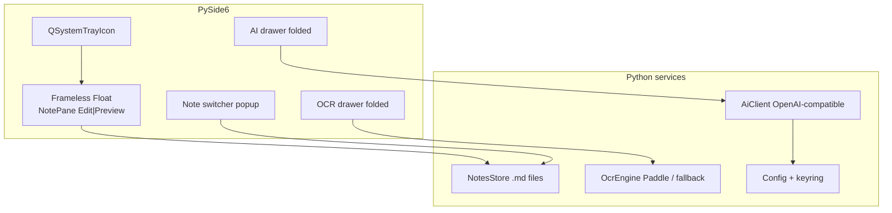

# FloatMD — 桌面悬浮笔记（Python / Qt / Windows）

| 字段 | 值 |
|------|-----|
| **版本** | 1.3 |
| **日期** | 2026-08-28 |
| **状态** | Draft（已按产品方向改栈） |
| **目标平台** | **Windows 优先**；Linux 后置 |
| **技术栈** | Python 3.11+ · **PySide6 (Qt6)** · PaddleOCR · OpenAI-compatible HTTP |

> 上一版 Tauri/Vue/Linux 方案已归档：`DESIGN-tauri-v05-archive.md`（仅作参考，不再作为实现基线）。

---

## 1. Overview

FloatMD 是一个**轻便的桌面悬浮工具**：主界面就是笔记本身（编辑 / 美化显示），可自由缩放；AI 解释/改写与 OCR 作为**按需折叠的辅助层**，默认不占版面。笔记以本地 `.md` 文件保存。

核心循环：

1. 打开悬浮窗 → 写笔记或预览 Markdown  
2. 编辑态多选行 → 「加入上下文」→ 点 **解释** 或 **改写**  
3. 解释：结果出现在可折叠 AI 条里  
4. 改写：确认后替换选中行  
5. OCR：折叠面板触发 → 截图/贴图识字 → 插入笔记  

**不做**：会话级聊天记忆、工具调用、长上下文 RAG、臃肿侧栏常驻。

---

## 2. Goals & Non-Goals

### Goals

| ID | 内容 |
|----|------|
| G1 | Windows 无边框 / 置顶 / 可拖拽缩放的悬浮主窗；系统托盘显隐 |
| G2 | 主区仅笔记：**编辑** ↔ **显示**；窗口尺寸用户自由调节并记忆 |
| G3 | 轻量切换其他 `.md`（下拉/弹出列表，非 Tabs、非常驻大侧栏） |
| G4 | AI 仅两动作：**解释**、**改写**；上下文 = 用户显式加入的选区（可多段），无会话历史 |
| G5 | OCR（Paddle 优先）按需展开；结果可插入/复制 |
| G6 | API Key 存 Windows Credential Manager；AI 走本机 HTTP 客户端 |

### Non-Goals (v1)

- 会话式多轮闲聊 / 长期记忆  
- Function calling / Agent  
- 云同步、协作、插件市场  
- 默认展开的 AI/OCR/设置大面板  
- 首版强依赖 Linux（可后做）  

---

## 3. 为什么用 Qt（以及备选）

| 方案 | 结论 |
|------|------|
| **PySide6 + 无边框窗**（推荐） | 与「Python + Win + PaddleOCR」同栈；`WindowStaysOnTopHint` + `FramelessWindowHint` 成熟；可用 [PySide6-Frameless-Window](https://github.com/zhiyiYo/PyQt-Frameless-Window) 补 Aero Snap / 阴影 |
| Tauri / Electron | 预览美、生态大，但和 Paddle 侧车割裂，打包两套运行时；已放弃作基线 |
| Dear PyGui / tkinter | 悬浮/Markdown 预览/复杂控件成本更高，不推荐 |

**结论：按你的推荐走 PySide6；无异议。**

---

## 4. UX：轻便优先

### 4.1 默认只看见「笔记窗」

```
┌─────────────────────────────────────────┐
│ ≡笔记名 ▾ │ 编辑|显示 │ 📌 │ AI ▾ │ OCR ▾ │ ✕ │  ← 细顶栏
├─────────────────────────────────────────┤
│                                         │
│           笔记正文（可自由缩放）            │
│                                         │
└─────────────────────────────────────────┘
```

- **主窗 = 笔记**：编辑或显示二选一，占满客户区。  
- **切换笔记**：顶栏文件名旁的 ▾ 弹出**短列表**（搜索过滤 + 新建），点选即切；不做多标签页。  
- **AI / OCR / 设置**：顶栏按钮 **折叠触发**——展开为底部抽屉或轻量弹出层，用完可收起；默认收起。  
- 窗口位置与大小写入配置，下次恢复。

### 4.2 AI 交互（无会话记忆）

1. 编辑态选中多行 → **「加入上下文」**（可多次加入多段；上下文区显示片段预览，可单条移除 / 一键清空）。  
2. 输入一句可选的用户说明（可空）。  
3. 只提供两个按钮：  
   - **解释**：返回说明文字 → 显示在 AI 抽屉结果区（不改笔记）。  
   - **改写**：返回替换正文 → 预览 diff/纯文本 → 用户确认后替换**当前选区**（若上下文含多段，默认改写「当前编辑器选区」；多段仅作文案参考——见 Key Decisions）。  

**无聊天气泡流、无历史轮次回灌模型。** 每次请求 = 系统提示 + 当前上下文块 + 本次说明 + 动作类型。

### 4.3 OCR

- 顶栏 **OCR ▾** 展开：粘贴图片 / 拖入 / **区域截屏（自绘全屏半透明蒙层 + 拖拽画框）**。  
- 截屏流程：隐藏或降低主窗干扰 → 全屏 overlay 画框 → 用 `mss`（或等价）裁切矩形 → 交 OCR 线程。  
- 识别中显示进度；完成后「插入光标处 / 追加文末 / 复制」。  
- 收起后面板不占高度。

---

## 5. Proposed Design

### 5.1 架构



### 5.2 模块划分（建议仓库）

```
floatmd/
  app.py                 # QApplication + tray + 单实例
  ui/
    main_window.py       # 无边框悬浮主窗
    note_editor.py       # 编辑：行号 QPlainTextEdit 或 QsciScintilla
    note_preview.py      # 显示：QWebEngineView 或 markdown→HTML
    note_switcher.py     # 弹出切换列表
    ai_drawer.py         # 折叠：上下文芯片 + 解释/改写
    ocr_drawer.py
    settings_dialog.py   # 模态设置（非常驻）
  services/
    notes_store.py
    ai_client.py
    ocr_engine.py
    config.py
    secrets.py           # keyring
  resources/
    preview.css
    i18n/
```

### 5.3 编辑 / 显示

| 模式 | 实现 | 说明 |
|------|------|------|
| 编辑 | `QPlainTextEdit` + 行号 gutter（或 QScintilla） | 等宽字体；多行选择；「加入上下文」读 `textCursor` 选区 |
| 显示 | **`QWebEngineView`** + 本地 HTML 管线 | 只读美化：GFM、**代码高亮**、**KaTeX**、**Mermaid**；`html` 关闭或 DOMPurify 等价消毒；资源全部本地打包，禁止随意外网 |

**v1 预览（已确认）**：第一期就上 WebEngine 完整美化，不为省体积退回 QTextBrowser。

### 5.4 笔记存储

- 目录默认：`%LOCALAPPDATA%\FloatMD\notes\`  
- 纯 `.md`；防抖自动保存（约 600ms）+ 失焦/隐藏时 flush；临时文件 rename 防损坏  
- 切换列表：扫目录；删除进 `.trash\`  

### 5.5 AI 协议（极简）

OpenAI 兼容 `POST {baseURL}/chat/completions`。

**请求**：无历史 messages 数组堆会话；每次临时组装：

```text
system: 你是笔记助手。只输出一个 JSON：
{"action":"explain"|"rewrite","content":"..."}
explain = 解释上下文；rewrite = content 为改写后的正文（可多行）。

user:
[Context]
<<<
{用户加入的选区，多段用 --- 分隔}
>>>

[Instruction]   # 可空
{用户说明}

[Task]
explain | rewrite
```

**响应**：

```json
{"action":"explain","content":"..."}
{"action":"rewrite","content":"..."}
```

| 动作 | UI |
|------|-----|
| `explain` | 只填结果区 |
| `rewrite` | 弹出**确认框**（展示将写入的文本摘要/全文可滚动）→ 用户确认后替换**当前编辑器选区**（需仍有效）；取消则不改笔记；选区失效则只展示文本供手贴。**不做左右 diff。** |

无 tools；超时默认 60s；Key 仅在 `services/secrets` + `ai_client` 使用。

### 5.6 OCR

- **默认引擎**：PaddleOCR（与 Python 同进程或子进程，避免拖死 UI——**推荐 QThread/子进程**）。  
- 可选后续：Windows.Media.Ocr 作轻量英文备选。  
- UI 线程禁止直接跑重模型。

### 5.7 窗口行为（Windows）

- `FramelessWindowHint | WindowStaysOnTopHint`（钉住可关）  
- 自定义顶栏拖拽；边缘缩放（Frameless 库或自实现）  
- 托盘：显示/隐藏、退出、打开笔记目录  
- 热键（可选）：`Ctrl+Alt+Space` 显隐；失败则仅托盘  

---

## 6. Key Decisions

1. **PySide6 悬浮窗** — 对齐 Python/Win/Paddle；不用 Tauri。  
2. **主界面只有笔记** — AI/OCR/设置全部折叠或对话框触发。  
3. **笔记切换用弹出列表** — 不做 Tabs。  
4. **AI 两按钮：解释 / 改写** — 无会话记忆；上下文靠「加入选区」。  
5. **改写 = 局部行写回** — 点击「改写」时快照 `Lx–Ly` + SHA-256；确认后 `replace_line_range` 写回；原文变动则拒绝。多段上下文仅作参考。整篇替换只用于「排版」。  

6. **PaddleOCR 为主** — 后台线程/进程；Tesseract 非必须。  
7. **笔记目录** — `%LOCALAPPDATA%\FloatMD\notes`。  
8. **预览 v1 = WebEngine 完整美化** — KaTeX + 高亮 + Mermaid；本地资源。  
9. **分发 = PyInstaller 绿色目录** — 先可拷贝运行；正式安装包后置。  
10. **OCR 截屏 = 自绘画框** — 全屏蒙层拖拽选区，不用系统截图工具。  
11. **改写确认 = 确认框后替换** — 展示改写文本，确认写入选区；不做 diff。
12. **浅色主题** — 白底 + 墨绿 `#0F6B4C` / 青 `#0D9488` / 蓝 `#2563EB`；CJK 字体 Noto Sans CJK SC。
13. **AI 优化排版 `format`** — 整篇笔记结构化 Markdown（分段/标题/列表），确认后整篇替换。  

---

## 7. Open Questions（仍可再定）

1. 「钉住置顶」开关默认开还是关？（建议默认开）  
2. 热键 `Ctrl+Alt+Space` 显隐是否保留？（建议保留，可关）

---

## 8. PR / 实现切片（建议）

| 序 | 内容 |
|----|------|
| 1 | PySide6 无边框置顶窗 + 托盘 + 记忆几何 |
| 2 | 笔记读写 + 自动保存 + 弹出切换列表 |
| 3 | 编辑（行号）↔ 显示（QWebEngineView + KaTeX/高亮/Mermaid） |
| 4 | AI 抽屉：加入上下文 + 解释/改写 + Key/Endpoint 设置 |
| 5 | OCR 抽屉 + 自绘画框截屏 + Paddle 后台识别 + 插入 |
| 6 | PyInstaller 绿色目录打包与设置打磨 |

---

## 9. Risks

| 风险 | 缓解 |
|------|------|
| Paddle/Qt 打包体积大 | 可选组件；OCR 模型按需下载 |
| UI 线程卡顿 | OCR/AI 全部进 worker |
| 无边框 Win 缩放/Snap 怪异 | 用成熟 Frameless 库 |
| 模型不按 JSON 返回 | 强约束提示 + 解析失败只展示原文 |

---

## 10. References

- PySide6 frameless: zhiyiYo/PyQt-Frameless-Window（PySide6 分支）  
- Qt sticky notes 模式：frameless + `WindowStaysOnTopHint`  
- PaddleOCR Python API  
- OpenAI Chat Completions 兼容网关（DeepSeek / Ollama 等）  
- 归档方案：`DESIGN-tauri-v05-archive.md`
